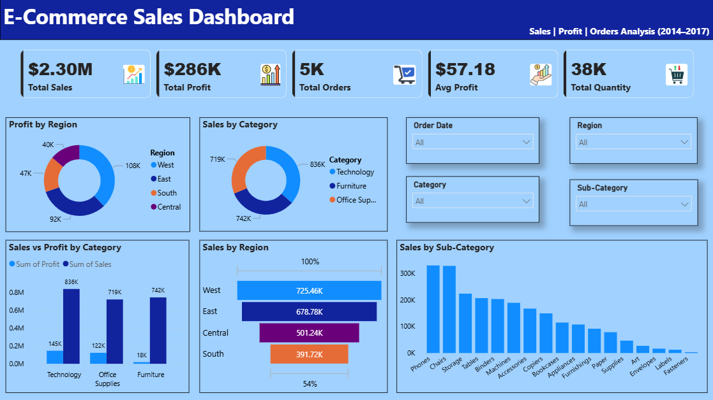

# 📊 E-Commerce Sales Performance Dashboard

## 🔍 Project Overview

This project presents an interactive **Power BI dashboard** built to analyze and visualize e-commerce sales data.
It provides key business insights into sales performance, profitability, customer behavior, and product trends.

---

## 📸 Dashboard Preview

---

## 🎯 Objectives

* Analyze overall business performance using key KPIs
* Identify top-performing categories, regions, and products
* Understand customer purchasing patterns
* Enable interactive filtering for dynamic analysis

---

## 📌 Key KPIs

* 💰 **Total Sales:** $2.30M
* 📈 **Total Profit:** $286K
* 📦 **Total Orders:** 5K
* 💸 **Average Profit per Order:** $57.18
* 🔢 **Total Quantity Sold:** 38K

---

## 📊 Dashboard Features

* Sales & Profit analysis by **Category**
* Regional performance insights (**West, East, Central, South**)
* Sub-category level sales breakdown
* Sales vs Profit comparison
* Interactive slicers:

  * Order Date
  * Region
  * Category
  * Sub-Category

---

## 🛠 Tools & Technologies Used

* **Power BI** – Data visualization & dashboard creation
* **Python (Pandas)** – Data cleaning & preprocessing
* **SQL (MySQL)** – Data querying and analysis

---

## 🗄 SQL Analysis

SQL was used to extract, transform, and analyze the dataset before visualization.

### Key Queries:

* Total Sales, Profit, and Orders calculation
* Category-wise and Region-wise analysis
* Sub-category performance breakdown
* Top products and customers identification

---

## 🧠 Advanced SQL Analysis

Advanced SQL techniques were applied to perform in-depth business analysis:

* **Aggregations & KPIs** → SUM(), AVG(), COUNT(), ROUND()
* **GROUP BY Analysis** → Category, Region, Sub-Category insights
* **Time-Based Analysis** → Monthly & yearly trends using YEAR() and MONTH()
* **HAVING Clause** → Identified loss-making products (Profit < 0)
* **Top N Analysis** → Top products and customers using ORDER BY & LIMIT
* **Derived Metrics** → Profit Margin (%) calculation
* **Customer Analysis** → High-value customer identification
* **Discount Impact Analysis** → Effect of discounts on profit
* **Operational Insight** → Average delivery time using DATEDIFF()

These analyses helped uncover actionable business insights and supported decision-making.

---

## 📈 Key Insights

* 🟢 Technology category generates the highest sales
* 🟢 West region contributes the most revenue
* 🔴 Some products are consistently loss-making
* 🟡 Discounts significantly impact profitability
* 📦 Average delivery time provides operational insights
  
---

## 👨‍💻 Author

**Himanshu Lamba**
Aspiring Data Analyst

* 🔗 LinkedIn: https://www.linkedin.com/in/himanshu-lamba-54136833a
  
---
